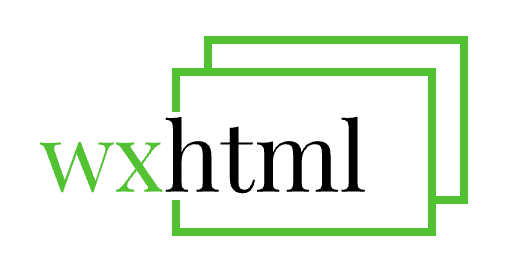

# `<wxhtml />` 小程序富文本组件


## 对比

||`rich-text`|`wxhtml`|
|---|---|---|
|点击事件|❌|✅|
|自定义组件|❌|✅|
|主题配置|❌|✅|


## ClickEvent 点击事件 [TODO]
`<wxhtml bindclick="onclick" />`
## Custome 自定义组件 [TODO]
`<wxhtml generic:elements="custome" />`

```html
<template name="demo">
  <demo attrs="{{node.attrs}}" name="{{node.name}}" body="{{node.body}}"></demo>
</template>
<template name="whoami">
  <whoami node="{{node}}"></whoami>
</template>
<template name="img">
  <image
    data-index="{{node.__index}}"
    src="{{node.attrs.src}}"
    class="{{attrs.class}}"
    style="{{attrs.style}}"
    mode="aspectFit">
  </image>
</template>
<template name="video">
  <video
    data-index="{{__index}}"
    src="{{attrs.src}}"
    class="{{attrs.class}}"
    style="{{attrs.style}}"
    loop="{{attrs.loop}}"
    controls="{{attrs.controls}}"
    autoplay="{{attrs.autoplay}}" >
   </video>
</template>
<view>
  <template is="{{node.name}}" data="{{ node }}"></template>
</view>

```
## Theme 主题 [TODO]
`<wxhtml theme="custome" />`
